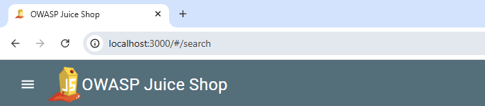

This is my attempt at figuring out the [OWASP Juice Shop](https://owasp.org/www-project-juice-shop/). It is a work in progress.

Index
- [Juice Shop container](#the-juice-shop-container)
- [Kali container](#the-kali-container)
- [Initial enumeration](#initial-enumeration)
- [First exploit](#dom-based-xss-injection---my-first-exploit)

## The Juice Shop container

I want to set up a docker container for the juice shop so I can reset it when needed.

    docker pull bkimminich/juice-shop
    docker run --name myjuiceshop -e NODE_ENV=unsafe -p 3000:3000 bkimminich/juice-shop

After this I can access it through a webbrowser or Burp using localhost:3000.

## The Kali container

I also want to set up a docker container for pentesting, enumeration and general analysis from a CLI for ease and conveniance.

Some tools I will need or want a GUI for, so those I will probably perform on the host machine, such as Burp Suite.

[Link to dockerfile](attackali/dockerfile)

- Main: kalilinux/kali-rolling
- Shell: zsh
- Tools: curl, gobuster, sqlmap

To start the docker kali container

    docker run -it --name attackali attackali /bin/zsh

## Initial enumeration

The first thing I want to test is Gobuster, and immediately I get an error.

This means that OWASP returns a 200 ok for everything, even if it's missing. So I have to tweak some stuff to get around this problem.

    curl -i http://host.docker.internal:3000

I get the response that content length is 75055, so I'll exclude this in my next run of Gobuster.

    gobuster dir -u http://host.docker.internal:3000 -w /usr/share/wordlists/common.txt --exclude-length 75055

We found quite a few interesting things.

Now I should probably just use Burp and look around to begin with.

It was all a mess for a good while, I followed the instructions and looked at the main.js code and found it all confusing. So I went the other direction and "guessed" some URL:s, since I had done the gobuster search I checked out robots.txt and then security.txt which led me to the scoreboard.

Afterwards I did find the relevant part of the js-code, I believe. And a few other interesting paths to check out later.

## DOM-based XSS injection - My first exploit

I decided to start easy and try out the DOM-based XSS injection, this was simply done by typing 
    
    <iframe src="javascript:alert(`xss`)">

into the search bar.

A short summary of DOM-based XSS injections

With user input it is possible to inject harmful code into the webpage and make the webpage to execute it as code.
This type of attack makes it possible to steal session tokens, user data etc from a legitimate user. With said tokens the attacker can hijack a session and basically become the user without ever needing their password. A harmful DOM-based XSS injection attack is most likely done through phishing where they inbed the injection into a hyperlink that is then sent to the victim. 
